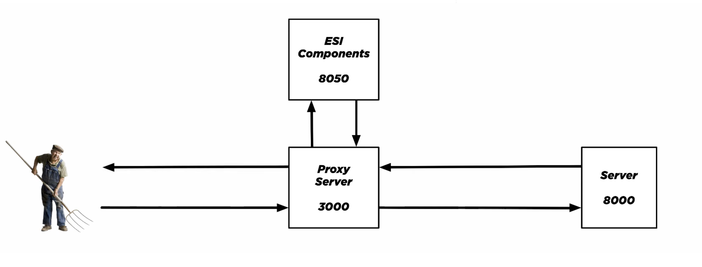

# ESI

## Model

### Install dependencies in proxy folder:
`yarn install`

### Go to `origin` folder and run:
`python -m SimpleHTTPServer 8000`

### Go to `components` folder and run:
`python -m SimpleHTTPServer 8050`

### Go to `proxy` folder and run:
`node server`

